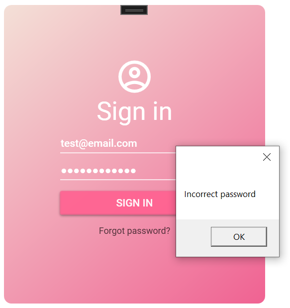
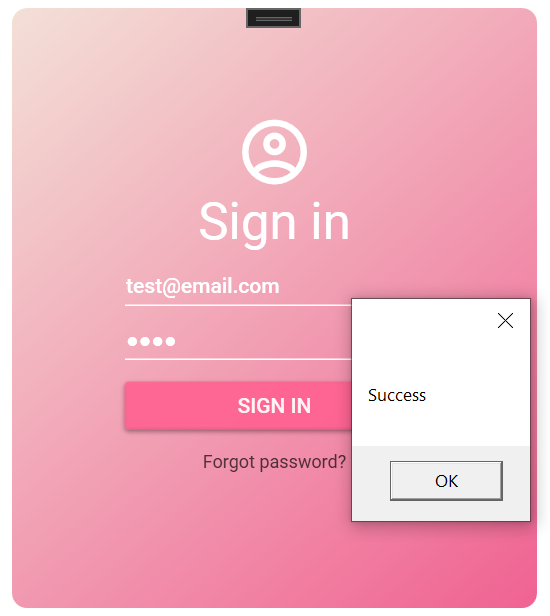
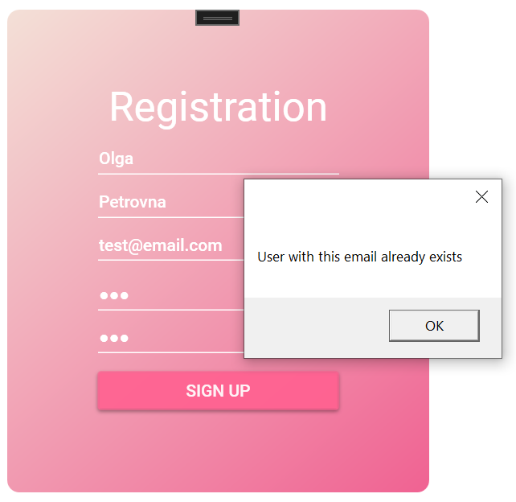
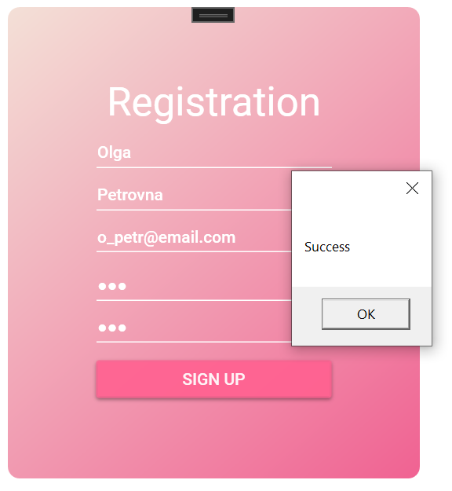
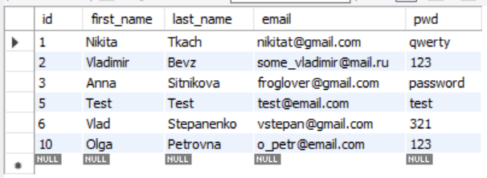
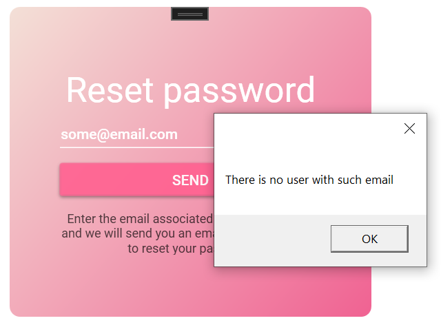
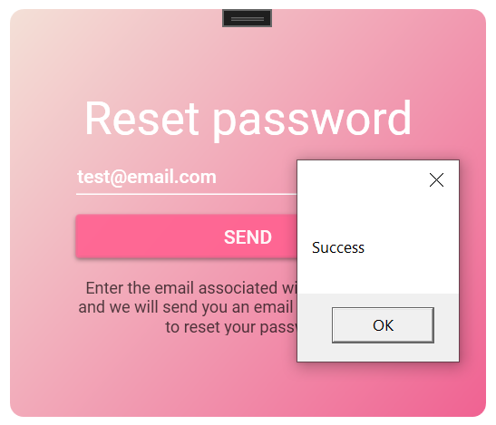

UI was implemented using WPF and Material Theme plugin
Application is communicating with my 
<a href="https://github.com/ChernyHleb/NikitaLogisoftAPI">REST API</a>
<ol>
  <h3><li>Sign in</li></h3>
  <a href="https://github.com/ChernyHleb/NikitaLogisoftLoginRegistrationForms/blob/master/NikitaLogisoftLoginRegistrationForms/SignInWindow.xaml">link to xaml</a>
   
  
  
  
  
  <h3><li>Registration</li></h3>
  <a href="https://github.com/ChernyHleb/NikitaLogisoftLoginRegistrationForms/blob/master/NikitaLogisoftLoginRegistrationForms/RegistrationWindow.xaml">link to xaml</a>
   
  
  
  
   
  Result in database:
   
  
  
  <h3><li>Reset Password</li></h3>
  <a href="https://github.com/ChernyHleb/NikitaLogisoftLoginRegistrationForms/blob/master/NikitaLogisoftLoginRegistrationForms/ResetPasswordWindow.xaml">link to xaml</a>
   
  
  
  
</ol>

